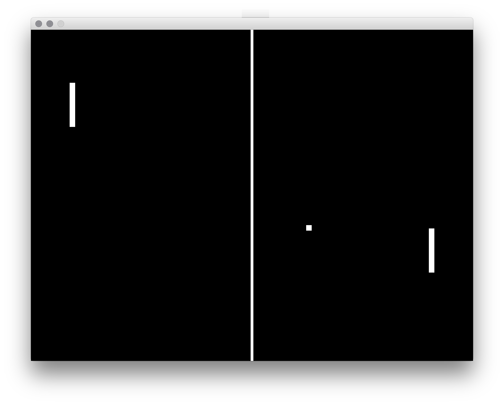

# permu-pong

Proceesing.py + Arduino Pong tutorial files

Providing multiple input and game parameters, thereby allowing the student to generate variations of Pong by playing with different combinations of Processing variables and Arduino inputs.

## todo

* debounce button input
* serve
* restart on score
* ...
